# LangGraph Agent — Complaint Handling Workflow

```mermaid
flowchart TD
    START([START]) --> load_complaint

    load_complaint["**load_complaint**\nFetch complaint + customer history\nfrom Django API;\nmark complaint in-progress"]

    load_complaint --> classify

    classify["**classify**\nLLM classifies complaint category\n+ urgency with rationale"]

    classify --> await_classification_approval

    await_classification_approval{"**await_classification_approval**\n⏸ HITL interrupt\nEmployee reviews classification"}

    await_classification_approval -- "approved" --> persist_classification
    await_classification_approval -- "rejected\n(with comment)" --> classify

    persist_classification["**persist_classification**\nPATCH /api/complaints/&lt;id&gt;/\nwith confirmed class + urgency"]

    persist_classification --> summarize_history

    summarize_history["**summarize_history**\nLLM summarizes all prior messages\nwith this customer;\nflags if history is empty"]

    summarize_history --> await_history_feedback

    await_history_feedback{"**await_history_feedback**\n⏸ HITL interrupt\nEmployee adds guidance\n(or says 'no')"}

    await_history_feedback -- "comment captured" --> draft_response

    draft_response["**draft_response**\nLLM drafts reply using complaint,\nclassification, history summary,\nand employee comment"]

    draft_response --> await_draft_approval

    await_draft_approval{"**await_draft_approval**\n⏸ HITL interrupt\nEmployee approves or\nrequests revision"}

    await_draft_approval -- "approved" --> send_and_persist
    await_draft_approval -- "revision\nrequested" --> draft_response

    send_and_persist["**send_and_persist**\nPOST /api/messages/ (outbound)\nmark complaint processed"]

    send_and_persist --> END([END])

    style await_classification_approval fill:#fef3c7,stroke:#d97706
    style await_history_feedback fill:#fef3c7,stroke:#d97706
    style await_draft_approval fill:#fef3c7,stroke:#d97706
    style START fill:#d1fae5,stroke:#059669
    style END fill:#d1fae5,stroke:#059669
```

## Node reference

| Node | Type | Description |
|------|------|-------------|
| `load_complaint` | AI | Fetches complaint + full customer history from Django; marks complaint *in-progress* |
| `classify` | AI (LLM) | Structured-output call to classify category and urgency with a rationale sentence |
| `await_classification_approval` | **HITL** | Interrupts for employee confirmation; loops back to `classify` if rejected |
| `persist_classification` | AI | PATCHes confirmed classification/urgency to Django |
| `summarize_history` | AI (LLM) | Summarises all prior correspondence with the customer; notes if empty |
| `await_history_feedback` | **HITL** | Interrupts for optional employee guidance before drafting |
| `draft_response` | AI (LLM) | Drafts the reply using complaint text, classification, history summary, and any comment |
| `await_draft_approval` | **HITL** | Interrupts for approval; loops back to `draft_response` with revision feedback if rejected |
| `send_and_persist` | AI | POSTs the outbound message to Django and marks the complaint *processed* |

**HITL** = Human-in-the-loop interrupt (yellow nodes). The employee interacts via the CopilotKit chat sidebar in the dashboard.
