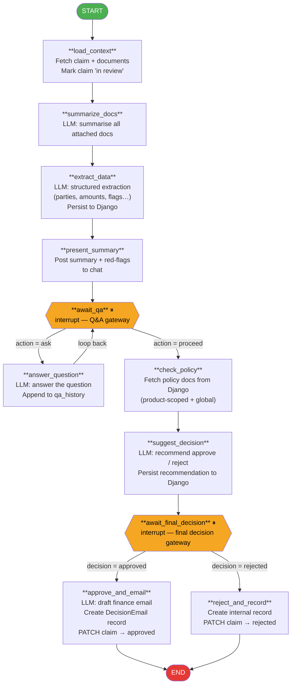

# LangGraph Agent — Flow Diagram

## Node reference

| Node | BPMN task | What it does |
|---|---|---|
| `load_context` | `Task_Load_Context` | GET `/api/claims/<id>/`, marks claim **in_review** |
| `summarize_docs` | `Task_Summarize_Docs` | LLM prose summary of every attached document |
| `extract_data` | `Task_Extract_Data` | Structured extraction via `_ExtractedData` Pydantic model; persisted to Django |
| `present_summary` | `Task_Present_Summary` | Posts summary + red-flags as an `AIMessage` |
| `await_qa` ⏸ | `Gateway_Questions` | `interrupt()` — waits for `{ action: "ask" \| "proceed" }` |
| `answer_question` | `Task_Answer_Questions` | LLM answers the question; appends to `qa_history`; loops back to `await_qa` |
| `check_policy` | `Task_Check_Policy` | Fetches policy docs from Django (product-scoped + global) |
| `suggest_decision` | `Task_Suggest_Decision` | LLM recommendation via `_DecisionOutput`; persisted to Django |
| `await_final_decision` ⏸ | `Gateway_Final_Decision` | `interrupt()` — waits for `{ decision: "approved" \| "rejected", notes }` |
| `approve_and_email` | `Task_Simulate_Email` | Drafts finance email, creates `DecisionEmail`, PATCHes claim **approved** |
| `reject_and_record` | `Task_Reject` | Creates internal `DecisionEmail` record, PATCHes claim **rejected** |

⏸ = LangGraph `interrupt()` — human-in-the-loop pause point
