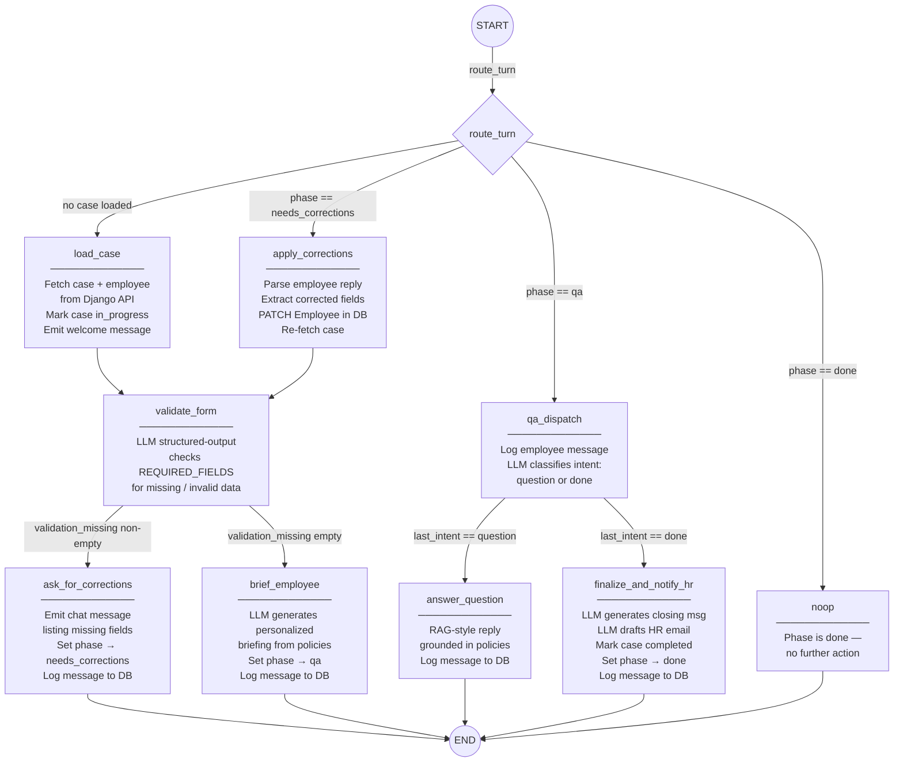

# LangGraph — Onboarding Agent

Each user message triggers one full graph run. State persists across turns via `MemorySaver`.

## Phase transitions

| Phase | Set by | Meaning |
|---|---|---|
| `new` | DB default | Case just created |
| `needs_corrections` | `ask_for_corrections` | Agent waiting for employee to provide missing fields |
| `qa` | `brief_employee` | Briefing delivered; open Q&A active |
| `done` | `finalize_and_notify_hr` | Onboarding complete; HR email simulated |

## Routing logic (per turn)

| Condition | Entry node |
|---|---|
| `state.case` is empty | `load_case` |
| `phase == needs_corrections` | `apply_corrections` |
| `phase == qa` | `qa_dispatch` |
| `phase == done` | `noop` |
