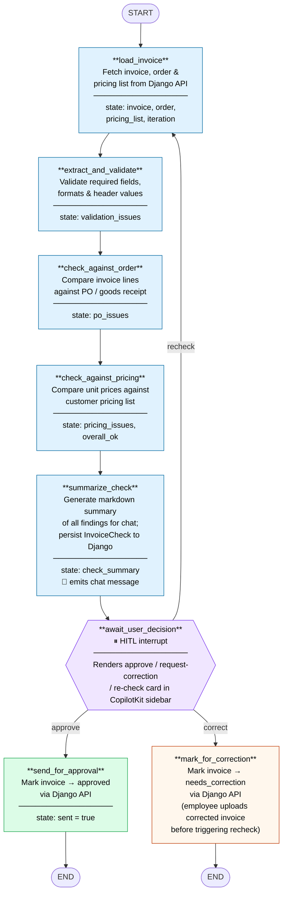

# LangGraph Agent — Flow Diagram

## State fields populated at each node

| Node | Reads | Writes |
|---|---|---|
| `load_invoice` | `invoice_id` | `invoice`, `order`, `pricing_list`, `iteration` |
| `extract_and_validate` | `invoice` | `validation_issues` |
| `check_against_order` | `invoice`, `order` | `po_issues` |
| `check_against_pricing` | `invoice`, `pricing_list` | `pricing_issues`, `overall_ok` |
| `summarize_check` | all issues, `invoice_id` | `check_summary` (→ Django `InvoiceCheck`) |
| `await_user_decision` | `check_summary`, `overall_ok` | — (interrupt; routes via `Command`) |
| `send_for_approval` | `invoice_id` | `sent` |
| `mark_for_correction` | `invoice_id` | — |

## Loop behaviour

When the finance employee selects **Request correction**, the graph ends at
`mark_for_correction` (invoice status → `needs_correction`). The employee then
edits the invoice via the upload-correction modal and clicks **Re-run check**,
which resolves the interrupt with `recheck` — jumping back to `load_invoice`
and incrementing `iteration`.
