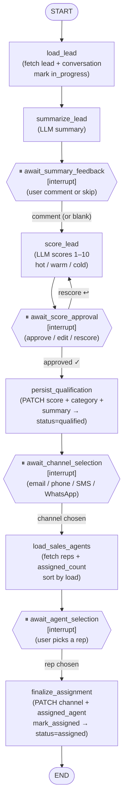

# LangGraph Workflow

```mermaid
flowchart TD
    START([START]) --> load_lead

    load_lead["load_lead\n(fetch lead + conversation\nmark in_progress)"]
    summarize_lead["summarize_lead\n(LLM summary)"]
    await_summary_feedback{{"⏸ await_summary_feedback\n[interrupt]\n(user comment or skip)"}}
    score_lead["score_lead\n(LLM scores 1–10\nhot / warm / cold)"]
    await_score_approval{{"⏸ await_score_approval\n[interrupt]\n(approve / edit / rescore)"}}
    persist_qualification["persist_qualification\n(PATCH score + category +\nsummary → status=qualified)"]
    await_channel_selection{{"⏸ await_channel_selection\n[interrupt]\n(email / phone / SMS / WhatsApp)"}}
    load_sales_agents["load_sales_agents\n(fetch reps + assigned_count\nsort by load)"]
    await_agent_selection{{"⏸ await_agent_selection\n[interrupt]\n(user picks a rep)"}}
    finalize_assignment["finalize_assignment\n(PATCH channel + assigned_agent\nmark_assigned → status=assigned)"]
    END([END])

    load_lead --> summarize_lead
    summarize_lead --> await_summary_feedback

    await_summary_feedback -- "comment (or blank)" --> score_lead

    score_lead --> await_score_approval
    await_score_approval -- "approved ✓" --> persist_qualification
    await_score_approval -- "rescore ↩" --> score_lead

    persist_qualification --> await_channel_selection
    await_channel_selection -- "channel chosen" --> load_sales_agents
    load_sales_agents --> await_agent_selection
    await_agent_selection -- "rep chosen" --> finalize_assignment
    finalize_assignment --> END
```
